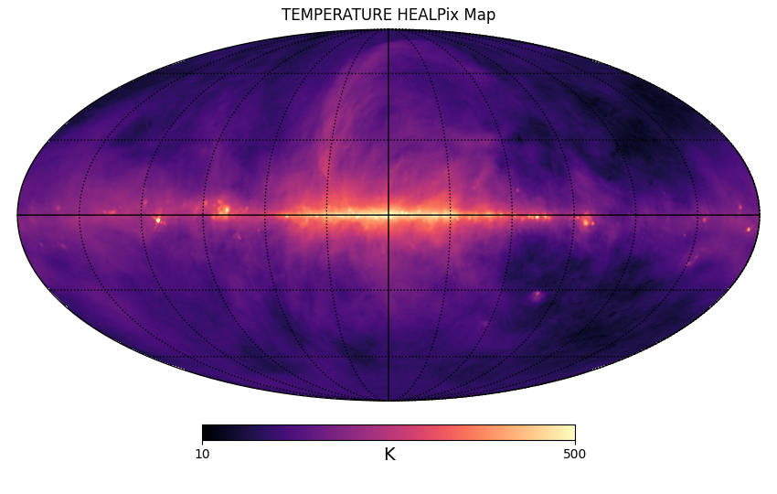

# plotFITS
simple script to plot HealPIX sky map from a FITS file.

```
usage: plotFITS [-h] [--hdu HDU] [--list] [--log] [--min MIN] [--max MAX]
                [--cmap CMAP] [--save SAVE] [--grid] [--cartview]
                [--ncolors NCOLORS]
                filename [column]
```
for instance,
```
/plotFITS --min 10 --max 500 --grid --log --cmap magma --save sky.png haslam408_dsds_Remazeilles2014_ns2048.fits TEMPERATURE
```
produces the following plot:

using the FITS file located [here](https://lambda.gsfc.nasa.gov/data/foregrounds/haslam_2014/haslam408_dsds_Remazeilles2014_ns2048.fits) (Haslam 408 MHz reprocessed by Remazeilles+2014)
